# [已完成] 聊天记录持久化与历史回显方案

> **状态**：已完成 (Completed)  
> **创建时间**：2026-08-22  
> **完成时间**：2026-08-22  
> **所属模块**：会话持久化 / 数据库迁移 / 前后端历史回显  

---

## 1. 方案目标

为微光（Weiguang）应用增加完整的**聊天记录数据库持久化**与**历史消息回显**能力。使用户在刷新页面、重新登录或切换设备时，可以无缝查看之前的对话内容，并且为 AI 提供基于历史会话的多轮上下文记忆。

---

## 2. 架构与核心流程

```mermaid
flowchart TD
    subgraph Frontend ["前端 (ChatView.vue / VoiceView.vue)"]
        UI_Mount["页面加载 (onMounted)"] --> API_GetHistory["GET /api/chat/messages"]
        API_GetHistory --> RenderHistory["回显历史消息 (支持点击TTS)"]
        UserSend["用户发送文本/语音"] --> WS_Stream["WebSocket /api/realtime"]
        NewChat["开启新对话"] --> API_Clear["DELETE /api/chat/messages"]
    end

    subgraph Backend ["Go/Gin 网关 & 对话中继"]
        WS_Stream --> TurnHandler["开源/火山中继器 (omni_relay / volc)"]
        TurnHandler --"流式传输"--> Cloud_AI["云端 LLM / ASR / TTS API"]
        
        TurnHandler --"异步写入 (非阻塞)"--> DB_Save["ChatStore.SaveChatMessageAsync()"]
        
        API_GetHistory -.-> API_Handler["GET /api/chat/messages Handler"]
        API_Handler --> DB_Query["ChatStore.GetRecentChatMessages()"]
        API_Clear -.-> API_ClearHandler["DELETE /api/chat/messages Handler"]
        API_ClearHandler --> DB_Archive["ChatStore.ClearChatMessages()"]
    end

    subgraph Database ["PostgreSQL & Redis"]
        DB_Save --> PG_Tables[("chat_conversations\nchat_messages")]
        DB_Query --> PG_Tables
        DB_Archive --> PG_Tables
    end
```



---

## 3. 数据库设计 (Database Schema)

在 `internal/auth/migrations/006_chat_history.sql` 中已实现迁移：

### 3.1 `chat_conversations` (会话表)
```sql
CREATE TABLE IF NOT EXISTS chat_conversations (
    id TEXT PRIMARY KEY,
    user_id TEXT NOT NULL REFERENCES users(id) ON DELETE CASCADE,
    title VARCHAR(255) NOT NULL DEFAULT '新对话',
    provider VARCHAR(32) NOT NULL DEFAULT 'open_source',
    is_pinned BOOLEAN NOT NULL DEFAULT FALSE,
    is_archived BOOLEAN NOT NULL DEFAULT FALSE,
    created_at TIMESTAMPTZ NOT NULL DEFAULT NOW(),
    updated_at TIMESTAMPTZ NOT NULL DEFAULT NOW()
);

CREATE INDEX IF NOT EXISTS idx_chat_conversations_user_updated
    ON chat_conversations (user_id, is_archived, updated_at DESC);
```

### 3.2 `chat_messages` (消息明细表)
```sql
CREATE TABLE IF NOT EXISTS chat_messages (
    id BIGSERIAL PRIMARY KEY,
    conversation_id TEXT NOT NULL REFERENCES chat_conversations(id) ON DELETE CASCADE,
    user_id TEXT NOT NULL REFERENCES users(id) ON DELETE CASCADE,
    role VARCHAR(16) NOT NULL CHECK (role IN ('user', 'ai', 'system')),
    content TEXT NOT NULL,
    kind VARCHAR(16) NOT NULL DEFAULT 'text' CHECK (kind IN ('text', 'voice')),
    status VARCHAR(16) NOT NULL DEFAULT 'completed' CHECK (status IN ('completed', 'interrupted', 'error')),
    audio_duration_ms INTEGER DEFAULT 0,
    created_at TIMESTAMPTZ NOT NULL DEFAULT NOW()
);

CREATE INDEX IF NOT EXISTS idx_chat_messages_conv_created
    ON chat_messages (conversation_id, created_at ASC);

CREATE INDEX IF NOT EXISTS idx_chat_messages_user_created
    ON chat_messages (user_id, created_at DESC);
```

---

## 4. 后端落库与中继设计 (Backend Implementation)

### 4.1 写入时机 (Write Path) - 绝对保证实时音频零阻塞
- **异步落库机制 (`SaveChatMessageAsync`)**：所有写入操作均在独立轻量 Goroutine 中执行，带有 10 秒超时保护，彻底杜绝数据库 I/O 阻塞 20ms 的 WebSocket 音频推流。
- **开源双工语音与文字 (`omni_relay.go`)**：
  - 用户查询：在收到 `text.query` / `voice.query` 时异步写入一条 `role: 'user'`；
  - AI 回复：在流式过程中累积 token，当官方 Full-Duplex 回合结束边界 `kind=listen` 到达时，异步写入一条完整 `role: 'ai'` 记录。
- **云端实时语音 API (`realtime.go`)**：在 `EventChatEnded` 时异步落库。

### 4.2 上下文恢复 (Context Injection)
- 中继建连时调用 `initHistory(ctx)`，自动从数据库拉取最近 10 轮对话预填充至模型上下文 `r.history`，实现多轮记忆连贯。

### 4.3 REST API 接口 (`internal/chat/handler.go`)
- `GET /api/chat/messages`：按时间正序返回当前会话的消息明细及分页支持。
- `DELETE /api/chat/messages` / `POST /api/chat/clear`：归档旧会话并创建新活动会话。

---

## 5. 前端交互与状态管理 (Frontend Implementation)

- **`ChatView.vue`**：
  - `onMounted` 钩子中自动调用 `fetchChatMessages`。
  - 若有历史消息，按用户与 AI 角色渲染到界面右侧与左侧气泡中，并滚动到底部；
  - 若无历史消息，展现默认欢迎语；
  - 历史 AI 消息带有 `▶` 按钮，点击依然可无缝请求 `/api/open-source/tts` 合成播放。
- **`AppNav.vue`**：
  - 顶部导航栏增加「新对话」按钮，点击时触发清空并重置为初始欢迎状态。

---

## 6. 验收与交付总结 (Delivery Summary)

- **数据库迁移**：`internal/auth/migrations/006_chat_history.sql` 验证通过。
- **单元与集成测试**：
  - `internal/auth/auth_test.go` (`TestChatHistoryPersistenceAndRetrieval`) 验证通过。
  - `internal/chat/handler_test.go` (`TestChatHandler_GetMessages`, `TestChatHandler_ClearMessages`) 验证通过。
  - `go vet ./...` 检查通过，无错误。
- **前端打包**：`npm run build` 打包验证通过，TypeScript 类型检查无任何告警。
